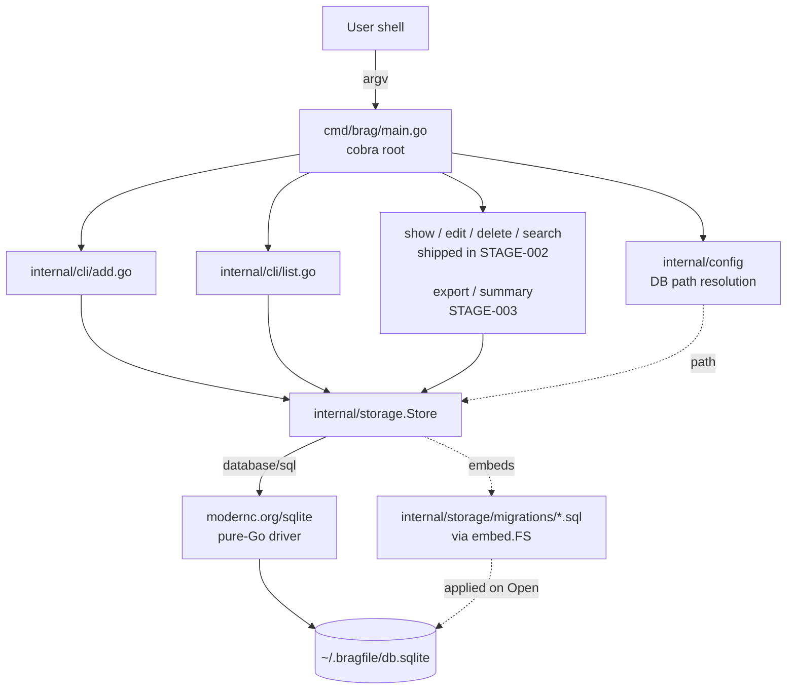

# Architecture

## Overview

`brag` is a single-binary, local-first CLI. It takes a command-line
invocation, translates it into a read or write against an embedded
SQLite database at `~/.bragfile/db.sqlite`, and prints the result to
stdout. There is no server, no network, no background process. All
persistent state lives in one SQLite file the user controls.

The design is deliberately small: Cobra for argv parsing,
`modernc.org/sqlite` (pure Go) for storage, and a thin `internal/storage`
package mediating between them. Future capabilities (editor-launch, FTS5
search, export, rule-based summary) layer on top of the same storage
without changing this shape.

## Components

### Responsibilities

| Package | Responsibility |
|---|---|
| `cmd/brag` | Process entrypoint. Constructs the root `*cobra.Command`, wires subcommands, handles top-level flags (`--db`, `--version`), calls `os.Exit` with the right code. Contains no business logic. |
| `internal/config` | Resolves the DB path from `--db` flag → `BRAGFILE_DB` env → `~/.bragfile/db.sqlite`. Creates parent directory on first use. Single source of truth for path resolution. |
| `internal/cli` | One file per subcommand. Each exports a `func New<Name>Cmd(deps) *cobra.Command`. Depends on `storage.Store` (an interface or concrete type) for all persistence. Does no SQL. |
| `internal/storage` | `Store` struct wrapping `*sql.DB`. Embeds migration SQL files and applies them on `Open`. Exposes typed methods (`Add`, `List`, `Get`, `Update`, `Delete`, `Search`) — no SQL leaks upward. Owns the `Entry` type. Plus an FTS5 ride-along table `entries_fts` that indexes title, description, tags, project, impact and stays in sync via SQL triggers (SPEC-011). |
| `internal/editor` | (STAGE-002) Launches `$EDITOR` against a templated markdown buffer; parses front-matter on save. |
| `internal/export` | (STAGE-003) Markdown-report and sqlite-file-copy exporters. |

## Key Design Principles

1. **Local-first, file-first.** The user's data is one file. Back it up
   by copying it. Move it between machines by copying it. No hidden
   state elsewhere. (DEC-001 — pure-Go SQLite driver.)
2. **CLI is a thin shell over `internal/storage`.** Subcommand files
   parse flags, call one `Store` method, and format output. No SQL in
   command code. This keeps commands easy to test and makes a future
   TUI or API layer a matter of adding another frontend.
3. **Migrations are code.** Numbered `.sql` files live in the storage
   package and are embedded at build time. No runtime migration config,
   no external migration tool. (DEC-002.)
4. **No CGO.** The entire binary is pure Go so goreleaser can
   cross-compile for every darwin/linux arch without a per-arch build
   matrix. (DEC-001.)
5. **Structured data, narrative body.** `entries` is a relational table
   *and* carries a free-form description field. A future AI summary
   feature can read structured fields for grouping and the body text
   for narrative, without a schema change. (DEC-005.)

## Boundaries and Interfaces

- **Argv → command.** Cobra handles the parse. Each subcommand file is
  responsible for converting parsed flags into method arguments for
  the `Store`.
- **Command → storage.** Subcommands hold a reference to a `*Store` (or
  a small interface for test fakes) and never touch `database/sql`
  directly. Acceptance tests for commands run against a real
  `t.TempDir()` SQLite file, not a mock.
- **Storage → disk.** The only I/O boundary. Errors surface as wrapped
  Go errors (`fmt.Errorf("add entry: %w", err)`); the CLI layer decides
  how to render them.
- **There is no network boundary.** Anything that would add one (LLM
  summary, sync) is out of scope for PROJ-001.

## Data Flow

Happy path for `brag add --title "shipped x"`:

1. `cmd/brag/main.go` builds the root command, resolves `--db`,
   constructs a `*storage.Store` via `storage.Open(path)`.
2. `storage.Open` runs any unapplied migrations inside a transaction,
   records them in `schema_migrations`, returns the store.
3. Cobra dispatches to `internal/cli/add.go`'s `RunE`. It reads flags
   into an `Entry` struct.
4. `addCmd.RunE` calls `store.Add(entry)`, which issues one `INSERT`
   and returns the generated ID and the hydrated row.
5. `addCmd.RunE` prints the ID to stdout and returns nil.
6. `cmd/brag` closes the store and exits 0.

`brag list` is the mirror image: parse flags → `store.List(filter)` →
iterate rows → format → print.

## Deployment Topology

There is none. `brag` is a single static binary that runs on the user's
machine. Distribution (STAGE-004) uses goreleaser to produce macOS
(arm64, x86_64) and Linux (arm64, x86_64) binaries; a homebrew tap at
`github.com/jysf/homebrew-bragfile` ships the macOS ones via
`brew install bragfile`.

## References

- Data model: [./data-model.md](./data-model.md)
- CLI surface: [./api-contract.md](./api-contract.md)
- Decisions: `/decisions/`
  - `DEC-001` — pure-Go SQLite driver (`modernc.org/sqlite`)
  - `DEC-002` — embedded migrations, no external migration library
  - `DEC-003` — config resolution order (flag → env → default)
  - `DEC-004` — tags stored as comma-joined string for MVP
  - `DEC-005` — integer auto-increment primary keys for MVP
