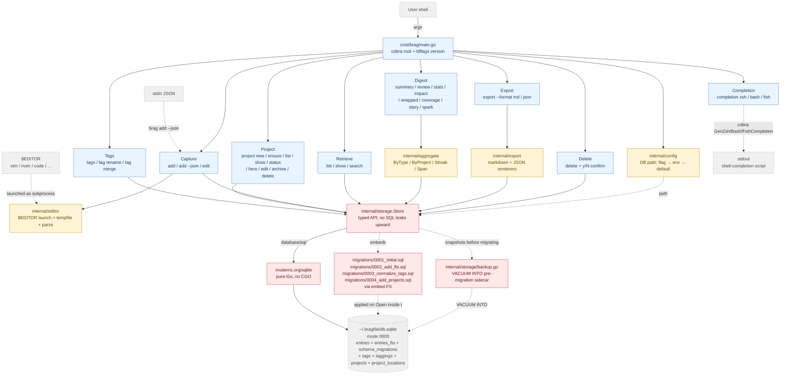

# Architecture

## Overview

`brag` is a single-binary, local-first CLI. It takes a command-line
invocation, translates it into a read or write against an embedded
SQLite database at `~/.bragfile/db.sqlite`, and prints the result to
stdout. There is no server, no network, no background process. All
persistent state lives in one SQLite file the user controls.

The design is deliberately small: Cobra for argv parsing,
`modernc.org/sqlite` (pure Go) for storage, and a thin `internal/storage`
package mediating between them. Future capabilities (editor-launch, FTS5
search, export, rule-based summary) layer on top of the same storage
without changing this shape.

## Components

Diagram conventions: blue = CLI command surface (Cobra); yellow =
internal helper packages; red = storage layer (the I/O boundary);
grey-dashed = external boundary (user, subprocesses, files, stdin/
stdout). The command surface is clustered into functional groups —
capture, retrieve, digest, export, delete, tags, projects, completion
— rather than listed individually; see the per-command contracts in
[./api-contract.md](./api-contract.md).

### Responsibilities

| Package | Responsibility |
|---|---|
| `cmd/brag` | Process entrypoint. Constructs the root `*cobra.Command`, wires subcommands, handles top-level flags (`--db`, `--version`), calls `os.Exit` with the right code. Contains no business logic. |
| `internal/config` | Resolves the DB path from `--db` flag → `BRAGFILE_DB` env → `~/.bragfile/db.sqlite`. Creates parent directory on first use. Single source of truth for path resolution. |
| `internal/cli` | One file per subcommand. Each exports a `func New<Name>Cmd(deps) *cobra.Command`. Depends on `storage.Store` (an interface or concrete type) for all persistence. Does no SQL. |
| `internal/storage` | `Store` struct wrapping `*sql.DB`. Embeds migration SQL files and applies them on `Open`. Exposes typed methods for entries (`Add`, `List`, `Get`, `Update`, `Delete`, `Search`), tags (`TagCounts`, `RenameTag`, `MergeTags`), and projects (`CreateProject`, `GetProject`, `GetProjectByName`, `ListProjects`, `ProjectStatuses`, `AddLocation`, `RemoveLocation`, `EditLocations`, `UpdateProject`, `ArchiveProject`, `DeleteProject`, `ProjectForPath`) — no SQL leaks upward. Owns the `Entry`, `TagCount`, `Project`, and `ProjectStatus` types. Projects are a first-class entity (`projects` + `project_locations` tables, DEC-017 / SPEC-027); `entries.project` joins `projects.name` by soft string match. Tags are stored in a normalized `tags`/`taggings` join (DEC-015 / SPEC-025); `Entry.Tags` is a reconstructed comma-joined projection. `entries_fts` (regular own-content FTS5) indexes title, description, tags projection, project, impact and stays in sync via 6 SQL triggers. On `Open`, `backup.go` snapshots an existing DB via `VACUUM INTO` to a timestamped sidecar **before** any pending migration runs and **aborts** the open if that snapshot fails — never migrating an un-backed-up DB (DEC-021). |
| `internal/editor` | (STAGE-002) Launches `$EDITOR` against a templated markdown buffer; parses front-matter on save. Used by `add` (no-args mode) and `edit`. |
| `internal/export` | (STAGE-003) Markdown-report and JSON exporters (`brag export --format markdown\|json`). |
| `internal/aggregate` | (STAGE-004) Rule-based digest helpers — `ByType` / `ByProject` / `GroupEntriesByProject` / `Streak` / `MostCommon` / `Span` / `rangeCutoff`. Shared by `summary`, `review`, and `stats` per DEC-014's rule-based output envelope. No SQL — operates over `[]Entry` returned by `Store`. |
| `internal/mcpserver` | (STAGE-009 / DEC-024) The `brag mcp serve` local stdio MCP server. Advertises four typed tools — `brag_add` / `brag_list` / `brag_search` / `brag_stats` — as thin wrappers over the same `Store`; SQL stays in `internal/storage`. `brag_add` stamps reserved `agent:<name>` / `model:<id>` provenance tags (DEC-024) so agent-authored entries are attributable with no schema change; `brag list --author agent\|human` reads that provenance back out. The stdio transport owns stdout for protocol frames — the `stdout-is-for-data` spine generalized to a new transport. This is the "another frontend over `Store`" that Key Design Principle 2 anticipated. Bundled — with a `/brag` slash-command and a session-end capture-nudge hook — as an installable Claude Code plugin under `plugin/` (DEC-025). |

## Key Design Principles

1. **Local-first, file-first.** The user's data is one file. Back it up
   by copying it. Move it between machines by copying it. No hidden
   state elsewhere. (DEC-001 — pure-Go SQLite driver.)
2. **CLI is a thin shell over `internal/storage`.** Subcommand files
   parse flags, call one `Store` method, and format output. No SQL in
   command code. This keeps commands easy to test and makes a future
   TUI or API layer a matter of adding another frontend.
3. **Migrations are code.** Numbered `.sql` files live in the storage
   package and are embedded at build time. No runtime migration config,
   no external migration tool. (DEC-002.)
4. **No CGO.** The entire binary is pure Go so goreleaser can
   cross-compile for every darwin/linux arch without a per-arch build
   matrix. (DEC-001.)
5. **Structured data, narrative body.** `entries` is a relational table
   *and* carries a free-form description field. A future AI summary
   feature can read structured fields for grouping and the body text
   for narrative, without a schema change. (DEC-005.)

## Boundaries and Interfaces

- **Argv → command.** Cobra handles the parse. Each subcommand file is
  responsible for converting parsed flags into method arguments for
  the `Store`.
- **Command → storage.** Subcommands hold a reference to a `*Store` (or
  a small interface for test fakes) and never touch `database/sql`
  directly. Acceptance tests for commands run against a real
  `t.TempDir()` SQLite file, not a mock.
- **Storage → disk.** The only I/O boundary. Errors surface as wrapped
  Go errors (`fmt.Errorf("add entry: %w", err)`); the CLI layer decides
  how to render them.
- **There is no network boundary.** Anything that would add one (LLM
  summary, sync) is out of scope for PROJ-001.

## Data Flow

Happy path for `brag add --title "shipped x"`:

1. `cmd/brag/main.go` builds the root command, resolves `--db`,
   constructs a `*storage.Store` via `storage.Open(path)`.
2. `storage.Open` runs any unapplied migrations inside a transaction,
   records them in `schema_migrations`, returns the store.
3. Cobra dispatches to `internal/cli/add.go`'s `RunE`. It reads flags
   into an `Entry` struct.
4. `addCmd.RunE` calls `store.Add(entry)`, which issues one `INSERT`
   and returns the generated ID and the hydrated row.
5. `addCmd.RunE` prints the ID to stdout and returns nil.
6. `cmd/brag` closes the store and exits 0.

`brag list` is the mirror image: parse flags → `store.List(filter)` →
iterate rows → format → print.

## Deployment Topology

There is none. `brag` is a single static binary that runs on the user's
machine. Distribution (STAGE-005) uses goreleaser to produce macOS
(arm64, amd64) and Linux (arm64, amd64) binaries; a homebrew tap at
`github.com/jysf/homebrew-bragfile` ships the macOS ones via
`brew install jysf/bragfile/bragfile`.

## References

- Data model: [./data-model.md](./data-model.md)
- CLI surface: [./api-contract.md](./api-contract.md)
- Decisions: `/decisions/`
  - `DEC-001` — pure-Go SQLite driver (`modernc.org/sqlite`)
  - `DEC-002` — embedded migrations, no external migration library
  - `DEC-003` — config resolution order (flag → env → default)
  - `DEC-004` — tags stored as comma-joined string for MVP (superseded by DEC-015)
  - `DEC-005` — integer auto-increment primary keys for MVP
  - `DEC-015` — normalized tag storage (`tags` + `taggings`, polymorphic; supersedes DEC-004)
  - `DEC-016` — tag mutation semantics (`brag tags`, `brag tag rename`, `brag tag merge`; merge via DELETE+INSERT, orphans invisible)
  - `DEC-017` — `entries.project` ↔ `projects` soft string match; project status enum + state_note
  - `DEC-018` — `brag project delete` blast radius (entries untouched; archive vs delete)
  - `DEC-019` — `brag project here` / add auto-fill nearest-ancestor resolution
  - `DEC-020` — `brag project edit` location-editing semantics (atomic, verbatim, no updated_at bump)
  - `DEC-021` — migration auto-backup durability model (VACUUM INTO snapshot before migrate; failure aborts)
