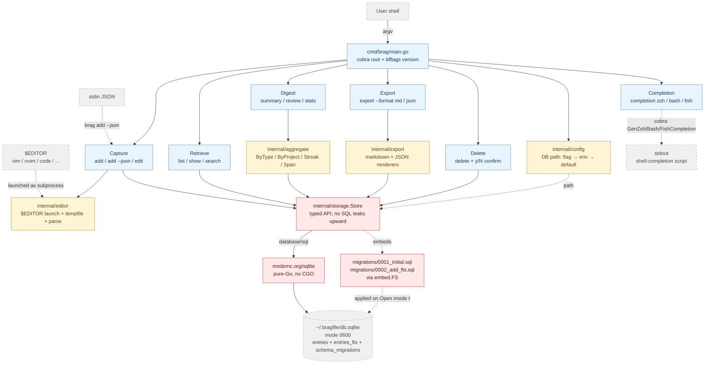

# How brag was built

bragfile is a small Go CLI — a few thousand lines, SQLite-backed. What's more interesting than the tool is how it got built: through a spec-driven development process, with Claude doing the design and implementation work across structured, deliberately separated sessions, and a human in the orchestration and review seat.

This is the build narrative. Roughly four weeks, five stages,
twenty-three specs.

## The hierarchy

The process organizes work as a hierarchy: **Repo → Project → Stage →
Spec → Cycle.**

- **Repo** — the codebase.
- **Project** — a coherent body of work with its own brief and success
  criteria. bragfile's MVP was one project: capture, retrieve, export,
  ship.
- **Stage** — a chunk of a project that ships as a unit. The MVP had
  five.
- **Spec** — a single unit of change: one feature, one pull request.
- **Cycle** — the lifecycle each spec moves through.

Nothing here is novel on its own. What makes it work is the cycle and
one rule about how the cycle is run.

## The five-cycle rhythm

Every spec moves through five cycles: **frame → design → build → verify
→ ship.**

Framing decides *what* to build. Design writes the spec — acceptance
criteria, failing tests, a detailed implementation context. Build writes
the code to make the failing tests pass. Verify reviews the result cold.
Ship merges, archives the spec, and records a reflection.

The rule that makes it work: **design, build, and verify each happen in
a fresh Claude session.** The design session writes the spec. A new
session — which has never seen the design conversation — does the build.
A third new session does the verify review.

## Why fresh sessions?

The tempting explanation is "different sessions are different
perspectives, so they catch more bugs." That's partly true but it isn't
the real mechanism. With a single underlying model, the verify session
isn't a meaningfully different reviewer. It's the same model.

What actually does the work is that **the spec file becomes the only
handoff.** If the spec doesn't say it, the build session doesn't know
it. That forces the spec to be genuinely complete — and a complete spec
is one you can verify against, because the spec *is* the contract. The
value is spec-as-source-of-truth, not a change of reviewer identity.

Naming that honestly doesn't diminish it. It reframes it. The discipline
isn't "get a second opinion" — it's "make the spec carry the entire
intent, then check the code against the spec, not against a memory of
the conversation."

Did it catch real bugs? Concretely, yes. In the first eight specs, two
had defects caught at verify that would otherwise have shipped silently:

- One spec's tests collapsed stdout and stderr into a single buffer, so
  a constraint — *data goes to stdout, messages for humans go to
  stderr* — was never actually verified.
- One spec's implementation notes said "either option is acceptable"
  for a test helper, and one of those options would have violated a
  blocking architectural constraint.

Both were design-session blind spots. Both were caught by a fresh verify
session reading only the spec and the diff. Without the fresh-session
discipline, both would be in the codebase today.

## The numbers

The MVP project ran from April 19 to May 17, 2026. Five stages, shipped
in framing order with no reordering:

1. **Foundations** — Go module, CLI scaffold, SQLite storage.
2. **Capture and retrieval** — add, list, show, edit, delete, search.
3. **Reports and AI-friendly I/O** — export, JSON in and out.
4. **Rule-based polish** — summary, review, stats.
5. **Distribution and cleanup** — Homebrew, CI, releases, completions.

Twenty-three specs shipped. Fourteen architectural decisions recorded,
and not one of them deprecated over the life of the project. Version
0.1.0 hit the public Homebrew tap on May 11.

## The shape of the binary

The architecture stayed boringly conventional. A Cobra CLI on top of a
typed storage package, with thin per-subcommand files in between.
Everything that needed the database went through one
`internal/storage.Store` type; nothing else touched SQL. The interesting
thing isn't the shape — it's what got *added* over five stages without
bending it: an editor-launch helper, a markdown/JSON exporter, a
rule-based digest package, an FTS5 ride-along table, a stdin JSON
input path, shell completions — each new spec extended the original
architecture rather than reshaping it.

Blue = CLI command surface. Yellow = internal helper packages. Red =
storage layer (the I/O boundary). Grey-dashed = external boundary
(user, subprocesses, files, stdin/stdout). The canonical version of
this diagram — plus a per-package responsibility table — lives in
[`docs/architecture.md`](../architecture.md).

## AGENTS.md — the rulebook that wrote itself

The most interesting artifact in the repo isn't the code. It's a file
called `AGENTS.md` — the conventions every cycle reads before it starts.

It began short. Over twenty-three specs it grew by roughly 150 lines of
codified rules. The crucial part: **none of those rules were invented up
front.** Every one was earned. A verify session would catch a bug. The
ship reflection would ask: what rule, written down, would have prevented
this? If the answer was concrete — a specific grep to run, a specific
check to make — and confirmed across enough cases, it got added.

A few that landed this way:

- Don't collapse stdout and stderr in tests; assert each independently.
- When a change alters a feature's status, grep every doc for mentions
  of that feature and audit each one — not just the obvious one.
- When a spec ships a fixed-shape artifact, embed it literally.

That last one is worth expanding.

## A lesson: embed the literal artifact

When a spec ships something whose exact shape is decidable at design
time — a config file, a JSON schema, a shell script, a help string —
the design session embeds the *literal file content* in the spec. The
build session transcribes it verbatim. Verify diffs the result against
the embedded copy.

Both cycles become mechanical. Design carries the cost of getting the
artifact right at the moment alternatives are still cheap to consider;
build and verify become near-zero-judgment transcription and diffing.
It sounds obvious in hindsight. It took three specs to notice the
pattern clearly enough to write it down.

## A sharper lesson: pre-flight the literal against its tool

The same idea, one level sharper. If a literal artifact's correctness
depends on an external tool — a release config that has to pass the
release tool's own validator, a shell-completion script whose expected
contents depend on which version of a CLI library is in use — then you
run the literal through that tool *at design time*, before declaring
the design done.

This rule earned its place through a matched pair. One spec skipped the
pre-flight: its release config embedded two keys the release tool had
since deprecated, and the failure surfaced late, costing a recovery
commit and a round of test fixes. A later spec did the pre-flight: it
ran a throwaway program against the actual CLI-library version, found
that an assumed marker string was wrong, corrected it mid-design, and
shipped with zero defects.

A costly miss and a cheap save — same rule, opposite outcomes.

## A meta-lesson: when two cases are enough

That pair produced a finding about the rule-making process itself.

Most rules in `AGENTS.md` had to clear a deliberately high bar: three
confirming cases before being written down, as a guard against
over-fitting to a single incident. But a rule that produces both a
costly miss *and* a cheap save needs only two cases — because each
outcome independently constrains the rule. The miss proves that
skipping the practice has a real cost. The save proves that doing it
prevents that cost. Together they're a complete argument in a way that
three same-direction confirmations are not.

That meta-rule — *paired opposing-outcome cases earn codification at
two; same-outcome cases still need three* — is itself now in
`AGENTS.md`. The rulebook grew a rule about how it grows.

## What was slow, honestly

It wasn't all smooth. The first four stages moved fast — one shipped in
a single day. The fifth, distribution, ran six days past its target.

Some of that was deliberate: a mid-stream pause for a full
pre-distribution security review before anything reached users. It was
worth it — it surfaced and fixed real hardening gaps and stood up
automated scanning that's still running. The rest was distribution
mechanics being genuinely fiddly: a release-tool quirk when two version
tags point at the same commit, macOS Gatekeeper blocking the unsigned
binary on first run. Each friction was either fixed or documented
honestly in `AGENTS.md` as an operational note — not papered over, not
carried as silent debt.

There's also an ongoing cost worth naming: every fresh session re-reads
a lot of context — the conventions file, the spec, the parent stage,
the brief, every referenced decision. As the project grew, a single
verify pass could pull several thousand lines of context before doing
any work. Not a blocker at this scale. Noticeable.

## The human's role

The human didn't write code. The human wrote the project briefs and
stage frames, reviewed every pull request, made the merge calls, ran the
git mechanics, and made calibration decisions — including which model to
assign to which cycle: a heavier model for design and orchestration,
where judgment compounds, and a lighter, cheaper model for the
mechanical build and verify cycles, where a thorough spec has already
done the hard thinking.

Orchestration and judgment, not implementation.

## Would I build the next thing this way?

For a project I intend to keep and extend: yes. The overhead is real,
and it is not the right shape for a throwaway script — the ceremony
would dwarf the work. But when the work decomposes into specs and
quality compounds, the spec-as-source-of-truth discipline and the
self-accumulating rulebook pay for themselves. Specs four, five, and six
shipped clean on the first try specifically because they inherited the
rules that specs one, two, and three had earned.

bragfile is feature-complete and on Homebrew. The `AGENTS.md` it
produced — every line of it earned rather than guessed — is the starting
point for whatever gets built next.
